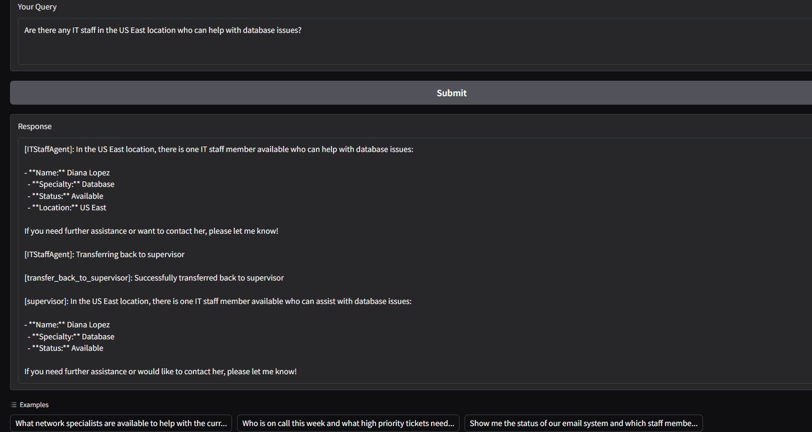

# IT Service Management Agent Orchestration System

> Learning Prototype & Knowledge Share

This repository is a **learning / exploration project** (with mocked data). The goal is to experiment with **multi-agent orchestration** using **LangGraph** and the **Model Context Protocol (MCP)**: how to segment domains into tool-backed agents, supervise them, and synthesize responses. The ITSM scenario (service desk + staff coordination) is a practical narrative to ground the design.

If you need a production system, treat this as an architectural sketch to iterate from.

---
## Real-World Applications

This system demonstrates how organizations can use AI to:

1. **Accelerate Incident Response**: Quickly match available specialists to critical incidents
2. **Improve Resource Allocation**: Identify staffing gaps for specific technical domains
3. **Enhance Situational Awareness**: Provide holistic views of both system status and staff availability
4. **Streamline Communication**: Reduce time spent gathering information from multiple systems

## Technologies Used

- **LangGraph**: Framework for building stateful, multi-agent workflows
- **Model Context Protocol (MCP)**: Protocol for standardized interaction with language models
- **Gradio**: Web interface for AI applications
- **OpenAI**: GPT models for agent intelligence
- **UV**: Fast Python package installer and resolver

## Requirements

- Python 3.10+
- OpenAI API key (configured in .env file)

## How It Works

This project demonstrates the orchestration of multiple AI agents using LangGraph and the Model Context Protocol:

1. **MCP Servers**: Two specialized MCP servers handle different ITSM domains:
   - `service_desk_mcp.py`: Provides information about IT tickets, system status, and incidents
   - `it_staff_mcp.py`: Manages IT staff availability, specialties, and on-call rotations

2. **Agent Orchestration**: The `agent_orchestration.py` file:
   - Creates specialized agents with appropriate tools from each MCP server
   - Sets up a supervisor agent that coordinates between the specialized agents
   - Presents a Gradio UI for user interaction

3. **Workflow**:
   - Help desk staff or managers submit queries through the Gradio interface
   - The supervisor agent breaks down the query into subtasks
   - Specialized agents use their tools to gather information
   - The supervisor integrates the responses into a cohesive answer

## Architecture Overview

```
┌────────────────────┐        ┌────────────────────┐
│  Service Desk MCP  │        │   IT Staff MCP     │
│ (tickets/incidents)│        │ (availability)     │
└─────────┬──────────┘        └─────────┬──────────┘
        │                               │
        ▼                               ▼
     Agent A                         Agent B
        \                               /
         \                             /
         ▼           Supervisor      ▼
             (Delegation / Merge)
                  │
                  ▼
               Gradio UI
```

### Roles
* **MCP Servers**: Isolated authoritative domains (tool boundaries)
* **Specialized Agents**: Thin wrappers around domain tools; they do not decide routing
* **Supervisor**: Decomposes query → sequences / parallelizes calls → synthesizes structured answer
* **UI**: Simple surface to observe behavior & iterate quickly


## Project Structure

```
.
├── .env                      # Environment variables (OpenAI API key)
├── pyproject.toml            # Python project configuration
├── uv.lock                   # Dependency lock file for uv package manager
├── langgraph/                # LangGraph implementation
│   └── agent_orchestration.py # Main orchestration logic
└── mcp_servers/              # Model Context Protocol servers
    ├── service_desk_mcp.py   # MCP server for IT service desk information
    └── it_staff_mcp.py       # MCP server for IT staff management
```

## Setup Instructions

1. **Create and activate a virtual environment**:
   ```bash
   uv virtualenv .venv
   .venv\Scripts\activate  # Windows
   # or
   source .venv/bin/activate  # Linux/Mac
   ```

2. **Install dependencies**:
   ```bash
   uv sync
   ```

3. **Run the application** (requires three separate terminals):

   Terminal 1 - Start the Service Desk MCP Server:
   ```bash
   .venv\Scripts\activate  # Windows
   cd mcp_servers
   python service_desk_mcp.py
   ```

   Terminal 2 - Start the IT Staff MCP Server:
   ```bash
   .venv\Scripts\activate  # Windows
   cd mcp_servers
   python it_staff_mcp.py
   ```

   Terminal 3 - Start the Agent Orchestration application:
   ```bash
   .venv\Scripts\activate  # Windows
   python langgraph/agent_orchestration.py
   ```

4. **Verify Python installation path** (if needed):
   ```bash
   (Get-Command python).path -replace '\\','/'
   ```

5. **Inspect MCP servers** (optional):
   ```bash
   npx @modelcontextprotocol/inspector
   ```

---

## Example Output



## Example Queries

- "What network specialists are available to help with the current critical network outage?"
- "Who is on call this week and what high priority tickets need attention?"
- "Show me the status of our email system and which staff members can address email issues"
- "Are there any critical incidents that don't have available specialists assigned?"

## Key Learning Goals
* Compare multi-agent graph vs single-agent w/ broad toolset
* Understand MCP as a clean extensibility layer
* Explore delegation heuristics (simple decomposition now; can evolve)
* Prepare ground for future evaluation of latency / cost trade-offs
